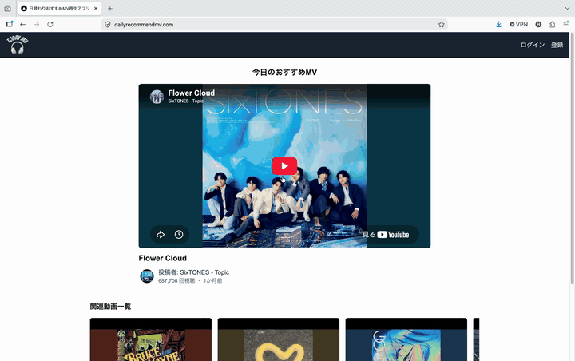
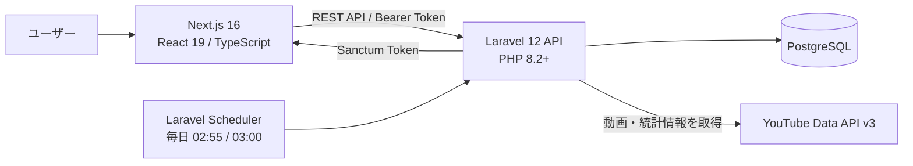
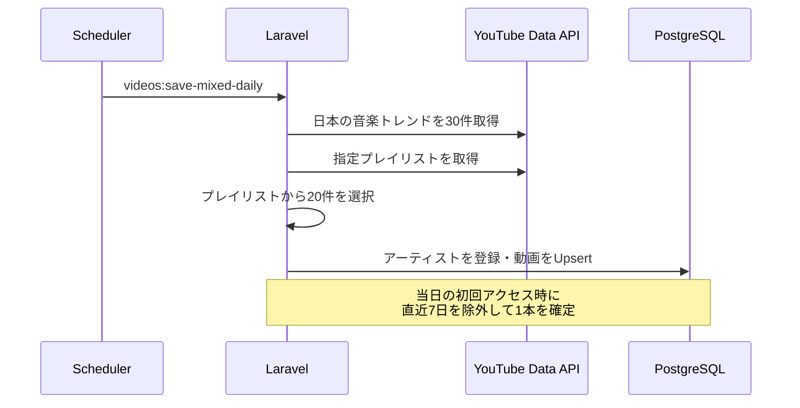
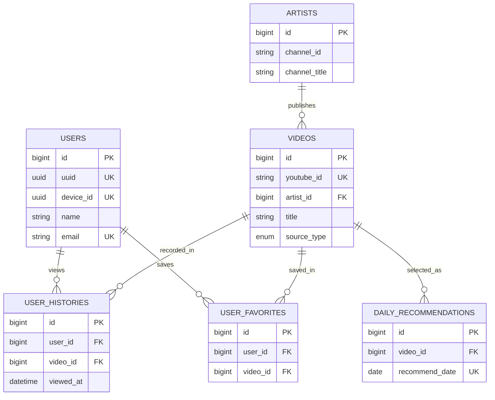

# Daily Recommend MV

> 毎日ひとつ、まだ知らない音楽との出会いを。

YouTubeの音楽トレンドとプレイリストから候補を自動収集し、全ユーザーに共通する「今日のおすすめMV」を1日1本届けるWebアプリケーションです。

選択肢を増やすのではなく、あえて1本に絞ることで「何を観ようか迷う時間」を減らし、偶然の音楽との出会いをつくります。

## デモ

今日のおすすめMVを起点に動画を閲覧し、お気に入りへ保存するまでの操作例です。

<p align="center">
  
</p>

## このプロジェクトで実現したこと

- **全ユーザーに共通する1日1本**  
  日付ごとの推薦結果をデータベースに保存し、アクセスするたびに内容が変わらない体験を実現しています。

- **マンネリ化を防ぐ推薦ロジック**  
  直近7日間に選ばれたMVを候補から除外し、同じ動画が短期間に繰り返されることを防いでいます。

- **外部APIに依存しすぎない構成**  
  YouTube Data APIから毎日候補を収集し、動画情報をキャッシュします。画面表示のたびにYouTube APIを呼ばないため、APIクォータと応答速度に配慮しています。

- **ゲストから会員へ自然に移行できる認証設計**  
  端末UUIDを利用した匿名ログイン(ゲストでログイン)に対応。会員登録時は匿名(ゲスト)ユーザーを正規ユーザーへ昇格させ、同じユーザーデータを引き継ぎます。

- **データ整合性と多重実行への配慮**  
  動画はYouTube IDをキーにUpsertし、日替わり推薦は日付のUNIQUE制約で1日1件を保証しています。推薦作成が競合した場合も、先に保存された結果を再取得します。

## 主な機能

| 機能 | 内容 |
| --- | --- |
| 今日のおすすめ | YouTube埋め込みプレイヤーで、その日の1本を表示 |
| 関連動画 | トレンド(急上昇)と指定プレイリスト(Catch Up Japan)から収集した動画を横スクロールで表示 |
| おすすめ履歴 | 過去の日替わりおすすめMVを一覧表示 |
| 視聴履歴 | ログインユーザーが閲覧した動画を記録・表示・削除 |
| お気に入り | 動画のお気に入り登録・解除・一覧表示 |
| 認証 | 匿名ログイン(ゲストでログイン)、会員登録、ログイン、ログアウト、プロフィール・パスワード変更 |
| 定期収集 | 毎日3:00にYouTubeから候補動画を収集し、重複なく保存 |
| トークン管理 | Laravel SanctumによるBearer Token認証と期限切れトークンの定期削除 |

## 技術的な工夫

### 1. 「今日の1本」を確実に固定する

推薦の初回取得時に当日のレコードを作成し、2回目以降は保存済みの結果を返します。`recommend_date`にはUNIQUE制約を設け、同時リクエストによる二重登録が発生した場合は、先に確定した推薦を再取得する設計です。

### 2. APIクォータを意識した動画キャッシュ

毎日3:00のバッチで、日本の音楽トレンド30件と指定プレイリスト20件を収集します。取得データは`youtube_id`をキーにUpsertし、タイトル・サムネイル・視聴回数などを更新。フロントエンドにはデータベース上の最新50件を返します。

### 3. 認証の有無でレスポンスを最適化

公開ページには任意認証ミドルウェアを適用しています。未ログインでも動画を閲覧でき、ログイン済みの場合のみ`is_favorite`などのユーザー固有情報を同じレスポンスへ付加します。

### 4. 匿名(ゲスト)体験から会員登録までを分断しない

初回利用時は端末UUIDを発行し、ゲストとして即時利用できます。その後の会員登録では新規ユーザーを作り直さず、匿名(ゲスト)ユーザーを正規ユーザーへ昇格。認証トークンも端末単位で管理しています。

### 5. 履歴の意図しない重複を抑制

動画詳細の連続リクエストによって同じ履歴が増えないよう、同一ユーザー・同一動画の記録が直近3秒以内に存在する場合は保存をスキップします。

## システム構成



### 日次データ更新



画面構成の詳細は[画面遷移図](documents/画面遷移図-v23.png)、仕様は[要件定義書](documents/要件定義書.md)をご覧ください。

## 技術スタック

| レイヤー | 技術 |
| --- | --- |
| Frontend | Next.js 16.2.9, React 19.2.3, TypeScript 5, Tailwind CSS 4 |
| Backend | PHP 8.2+, Laravel 12, Laravel Sanctum 4 |
| Database | PostgreSQL |
| External API | YouTube Data API v3 |
| Authentication | Bearer Token、端末UUIDによる匿名(ゲスト)認証 |
| Batch | Laravel Scheduler / Artisan Command |
| Quality | ESLint 9, PHPUnit 11, Laravel Pint |

## ディレクトリ構成

```text
DailyRecommendMV/
├── frontend/                 # Next.js App Router
│   ├── app/                  # ページ・レイアウト
│   ├── components/           # UIコンポーネント
│   ├── context/              # 認証コンテキスト
│   ├── hooks/                # 認証関連のカスタムフック
│   ├── lib/                  # APIクライアント・ユーティリティ
│   └── types/                # TypeScript型定義
├── backend/                  # Laravel REST API
│   ├── app/Http/Controllers/ # HTTPリクエストの制御
│   ├── app/Http/Resources/   # APIレスポンスの整形
│   ├── app/Services/         # ビジネスロジック
│   ├── app/Console/Commands/ # 定期実行コマンド
│   ├── database/migrations/  # DBスキーマ
│   └── routes/               # API・スケジューラ定義
└── documents/                # 要件定義書・画面遷移図
```

## セットアップ

### 必要な環境

- Node.js 20以上
- PHP 8.2以上
- Composer
- PostgreSQL
- YouTube Data API v3のAPIキー

### 1. リポジトリを取得

```bash
git clone https://github.com/hitsuji-man/DailyRecommendMV
cd DailyRecommendMV
```

### 2. バックエンド

```bash
cd backend
composer install
cp .env.example .env
php artisan key:generate
```

`backend/.env`にPostgreSQLとYouTube APIの設定を追加します。

```dotenv
APP_URL=http://localhost:8000
APP_LOCALE=ja

DB_CONNECTION=pgsql
DB_HOST=127.0.0.1
DB_PORT=5432
DB_DATABASE=dailyrecommendmv
DB_USERNAME=postgres
DB_PASSWORD=your_password

YOUTUBE_API_KEY=your_youtube_api_key
YOUTUBE_PLAYLIST_ID=your_playlist_id
FRONTEND_ORIGIN=http://localhost:3000
```

マイグレーションと初回の動画収集を実行します。

```bash
php artisan migrate
php artisan videos:save-mixed-daily
php artisan serve
```

APIは `http://localhost:8000` で起動します。

### 3. フロントエンド

別のターミナルで実行します。

```bash
cd frontend
npm ci
```

`frontend/.env.local`を作成します。

```dotenv
NEXT_PUBLIC_API_BASE_URL=http://localhost:8000/api/v1
```

```bash
npm run dev
```

ブラウザで `http://localhost:3000` を開きます。

### 4. スケジューラ

ローカルで定期処理を確認する場合は、別のターミナルで実行します。

```bash
cd backend
php artisan schedule:work
```

| 時刻 | コマンド | 役割 |
| --- | --- | --- |
| 02:55 | `tokens:purge-expired` | 期限切れPersonal Access Tokenの削除 |
| 03:00 | `videos:save-mixed-daily` | YouTubeから候補動画を収集・更新 |

## API概要

ベースURL: `http://localhost:8000/api/v1`

| Method | Endpoint | 内容 | 認証 |
| --- | --- | --- | --- |
| `GET` | `/recommendations/today` | 今日のおすすめMV | 任意 |
| `GET` | `/videos/mixed-daily` | 関連動画一覧 | 不要 |
| `GET` | `/videos/{id}` | 動画詳細・視聴履歴記録 | 任意 |
| `GET` | `/recommendations` | おすすめ履歴 | 必要 |
| `GET` | `/histories` | 視聴履歴 | 必要 |
| `DELETE` | `/histories/{id}` | 視聴履歴を1件削除 | 必要 |
| `DELETE` | `/histories` | 視聴履歴を全件削除 | 必要 |
| `GET` | `/favorites` | お気に入り一覧 | 必要 |
| `POST` | `/favorites/{id}` | お気に入り登録 | 必要 |
| `DELETE` | `/favorites/{id}` | お気に入り解除 | 必要 |
| `POST` | `/anonymous-login` | ゲストでログイン | 不要 |
| `POST` | `/register` | 会員登録 | 任意 |
| `POST` | `/login` | ログイン | 不要 |
| `POST` | `/logout` | ログアウト | 必要 |
| `GET / POST` | `/user` | プロフィール取得・更新 | 必要 |
| `POST` | `/user/password` | パスワード変更 | 必要 |

## データモデル

主要カラムとリレーションに絞る



> このER図はリレーションと主要カラムを把握しやすくするため、一部のカラムを省略しています。詳細な要件上の定義は要件定義書、実際の物理スキーマはLaravelのマイグレーションを参照してください。

## 今後の展望

- 推薦候補の比率や視聴傾向を用いた推薦ロジックの高度化
- アーティスト詳細・アーティスト別MV一覧の追加
- バッチ処理と外部API障害の監視・通知
- Feature Testの拡充とCI/CDの導入
- Google OAuthなど認証手段の追加

---

このプロジェクトでは、画面を作るだけでなく、外部API連携、定期バッチ、認証、データ整合性、将来の拡張性までを意識して、フロントエンドとバックエンドを一貫して設計・実装しています。
